= Sushi Shop
:author: Caffiaux Elian et Rodrigues Loïc
:docdate: 2023-03-30
:description: Projet SushiShop
:toc: left
:toclevels: 5

== Présentation
Il s'agit d'un site pour une prise de commande au niveau d’un point de vente de sushis. Avec l'utilisation du framework Angular pour le développementde l'appliaction et en utilisant une Api afin de collecter les données des différentes boxs de sushi de l'entreprise SushiShop afin d’approcher le plus d’une réalité commerciale.

== Fonctionnalités
Ce projet propose une application qui permet à l'utilisateur de commander des boxes de sushis et de les transmettre à la production (cuisine). Les fonctionnalités implémentées sont les suivantes :

- Une page de produits qui affiche tous les box disponibles dans l'API.
- Pour chaque box, un bouton permet d'accéder aux détails de la box (page de détails).
- Sur la page de détails, un bouton permet d'ajouter une box au panier (page panier).
- Sur la page panier, un bouton permet de passer une commande théorique pour les boxes.
- Accès à l'historique des commandes.

== Utilisation

====
La page "Produits" présente la liste des boxes de sushis disponibles à l'achat. Si vous souhaitez en savoir plus sur une box en particulier, il suffit de cliquer sur le bouton "Détails" correspondant.
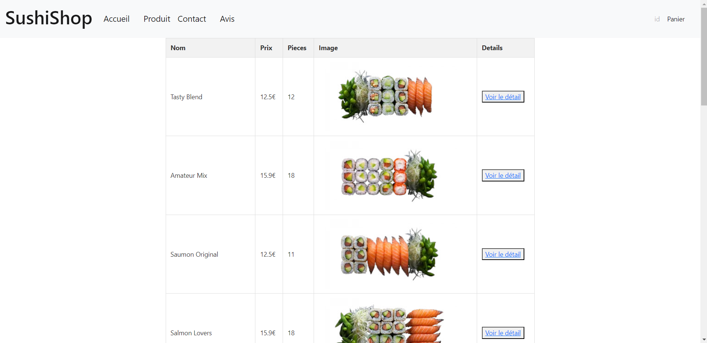
====

====
La page "Détails" affiche les informations détaillées de la box de sushis que vous avez sélectionnée. Vous pouvez également ajouter cette box à votre panier en cliquant sur le bouton "Ajouter au panier".
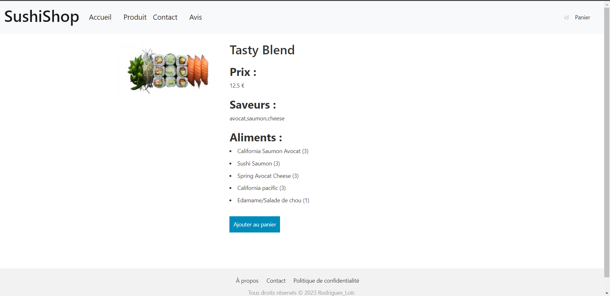
====

====
La page "Panier" affichera la liste des boxes de sushis que vous avez sélectionnées. Vous aurez la possibilité de passer votre commande (en théorie) en appuyant sur le bouton "Commander", et observer le montant total de votre commande. 
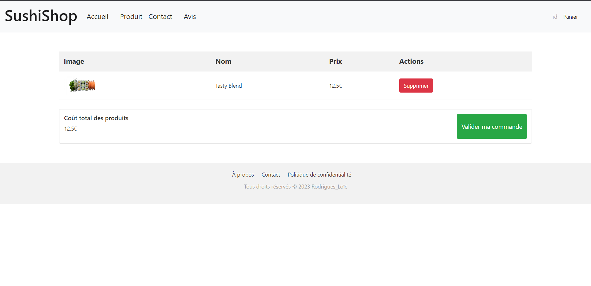
====

====
Enfin, vous pourrez consulter l'historique de vos commandes en cliquant sur l'onglet "Historique" dans la barre de navigation. Le rendu visuel de cette fonctionnalité sera finalisé ultérieurement.
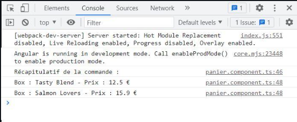
====

== Codes
=== Produits
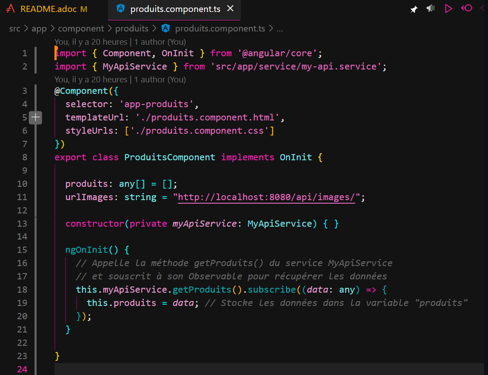

=== Détails
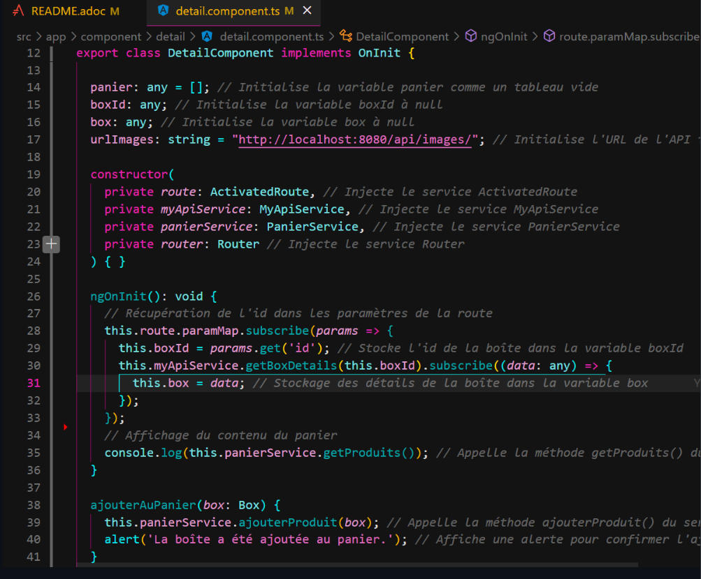

=== Panier
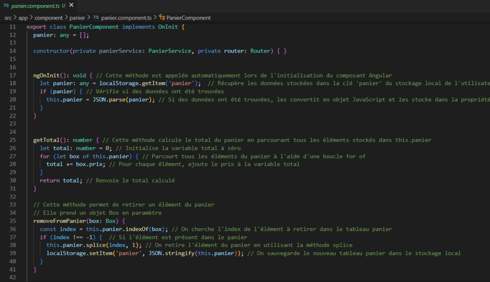
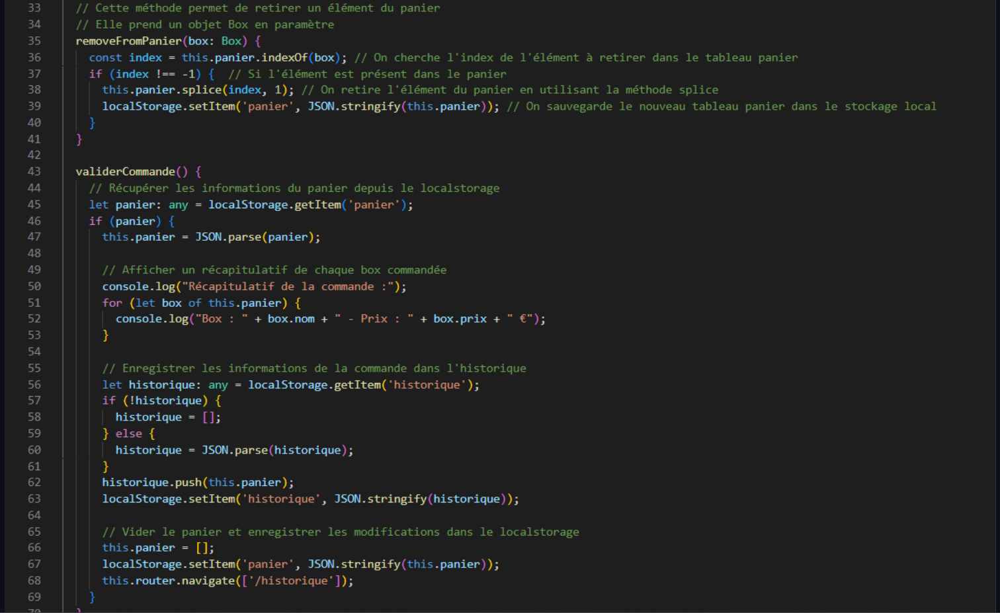

=== Service API
image:images/api.png[]

=== Service panier
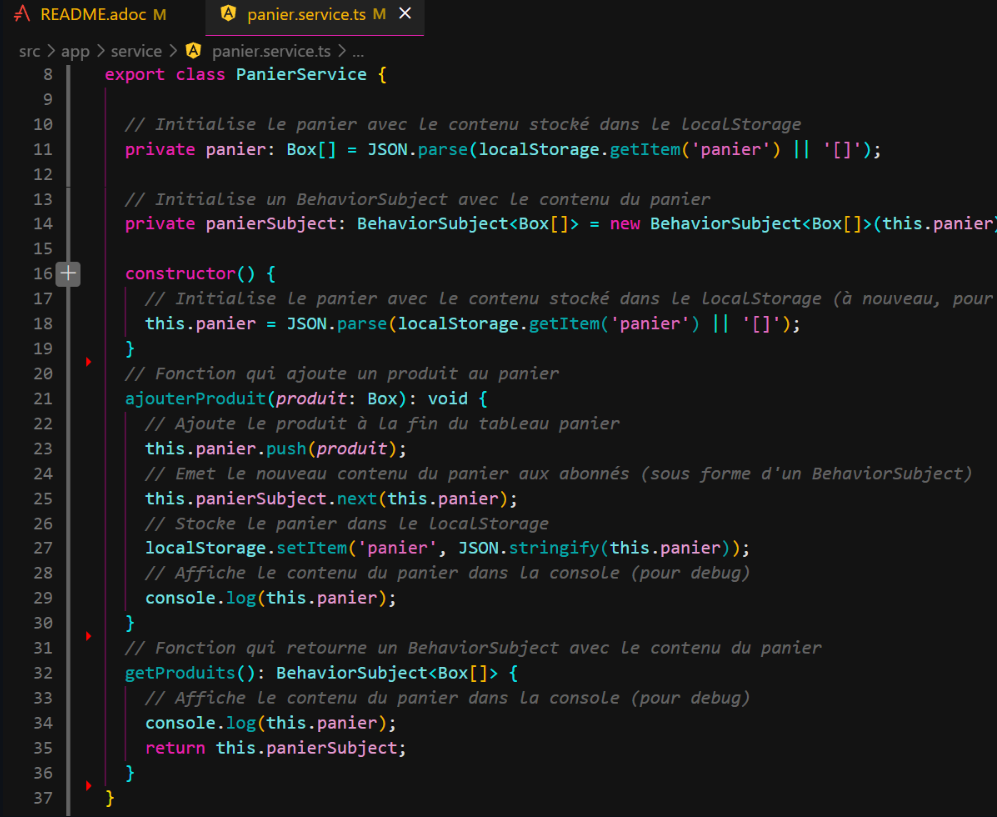

=== App Routing
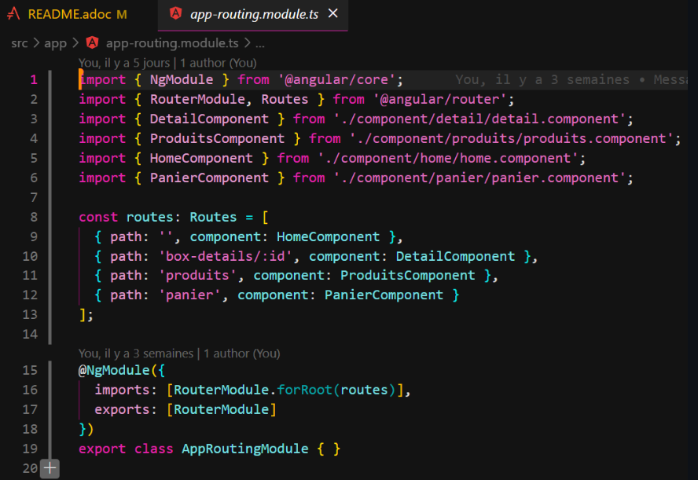

=== Box
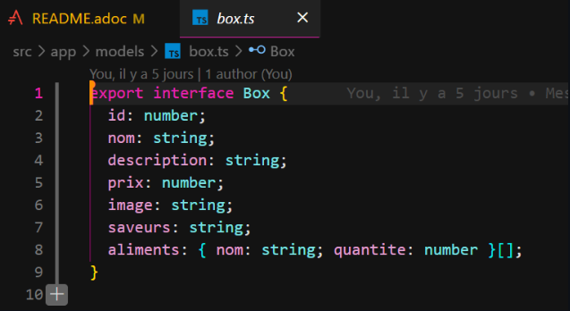

=== Produit (box) HTML
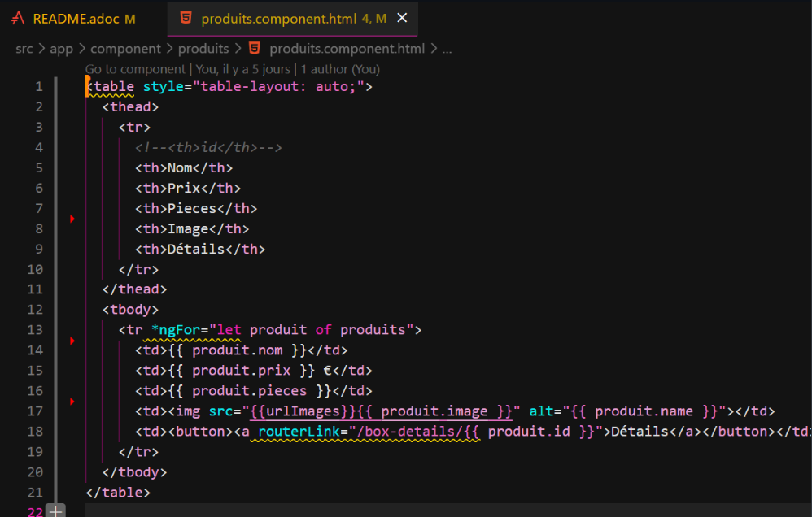

=== Détails (box) HTML
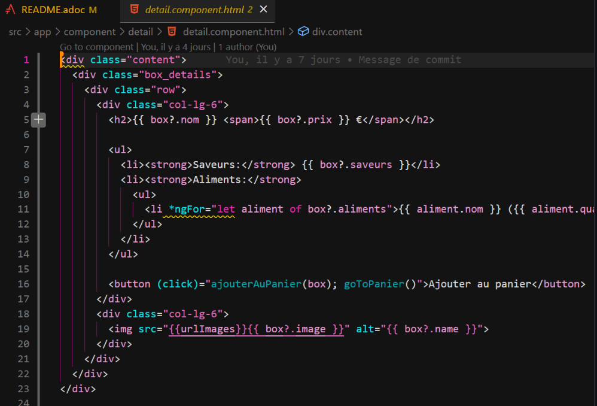

=== Environnement API
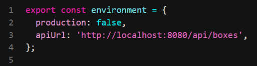

=== Code de l'API
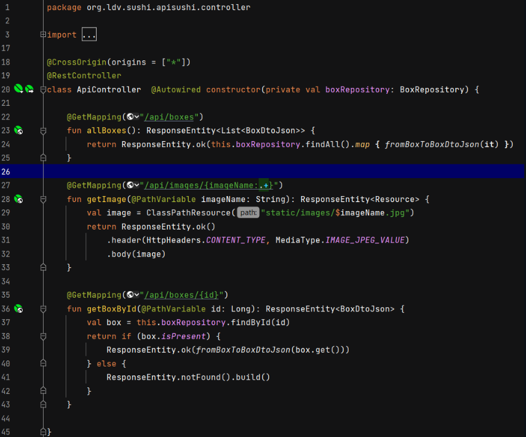
Ces fonctionnalités sont mises à disposition via des endpoints d'une API REST développée en Kotlin, qui permet de fournir des données et des images aux clients.

allBoxes() permet de renvoyer toutes les boîtes de sushis stockées en base de données, sous forme d'une liste d'objets de type BoxDtoJson.
getImage() permet de récupérer une image stockée dans le dossier "static/images" en fournissant son nom, et de renvoyer la ressource correspondante avec un type de contenu "image/jpeg".
getBoxById() permet de renvoyer une boîte de sushis stockée en base de données, en fournissant son ID, sous forme d'un objet BoxDtoJson. Si la boîte est introuvable, une réponse avec le statut "notFound()" est renvoyée.

== Diagramme
=== Diagramme d'utilisation
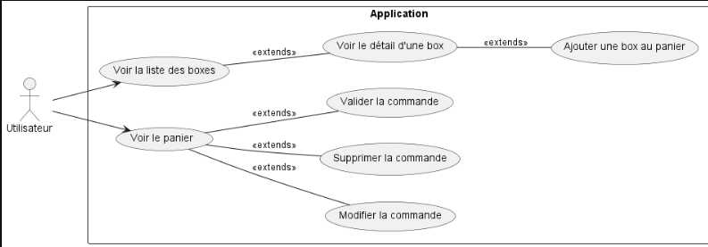

=== Diagramme des tiers
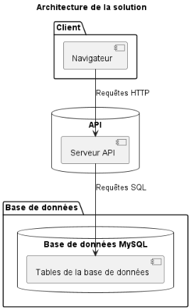

== Structure JSON
[source,json]
====
[source,json]
----
{
  "items": [
    {
      "id": 1,
      "date": 02/04/2023
      "name": "SushiBox1",
      "pieces": 6,
      "quantity": 2
    },
    {
      "id": 2,
      "date": 05/04/2023
      "name": "SushiBox2",
      "pieces": 8,
      "quantity": 1
    }
  ]
  "nomClient": "Paul lambert",
  "adresseLivraison": "23 Rue de la mairie, Paris",
  "telephone": "01 23 45 67 89",
}
----
====

== Cybersécurité
Voici une liste des scénarios de sécurité redoutés pour mon projet de site de vente de sushi :

- Le vol de données personnelles des clients, telles que les noms, les adresses, les numéros de téléphone et de cartes bancaires.
- Une attaque par déni de service (DDoS) qui empêche les clients d'accéder au site et de passer des commandes.
- Une injection de code malveillant (malware) dans le site Web, qui permettrait à des pirates informatiques d'intercepter les informations de paiement des clients.
- Une attaque de phishing, où les clients peuvent recevoir des e-mails frauduleux leur demandant de fournir des informations de compte ou de paiement.

Voici quelques contre-mesures (EvilUS) que nous pouvons prendre pour prévenir ces événements redoutés :

- Nous devons utiliser des pratiques de sécurité appropriées pour protéger les données des clients, comme le cryptage des données stockées et l'application d'une politique de mot de passe fort.
- Nous devons mettre en place des mesures de sécurité pour prévenir les attaques DDoS, comme l'utilisation d'un pare-feu et la surveillance de la bande passante pour détecter les pics de trafic suspects.
- Nous devons mettre à jour régulièrement le logiciel et les systèmes d'exploitation pour prévenir les vulnérabilités connues qui pourraient être exploitées par les pirates informatiques.
- Nous devons sensibiliser les clients aux techniques de phishing et leur fournir des informations claires sur les pratiques de sécurité du site pour éviter les fraudes.

== Conclusion
En résumé, la réalisation de ce projet a été bénéfique pour notre développement de compétences en Angular et en développement web. Nous avons acquis une expérience significative dans la conception d'une application d'e-commerce, l'intégration de composants et la création d'un système fonctionnel. Nous avons également amélioré nos capacités en matière de design et de développement d'interfaces utilisateur intuitives.

Ce projet a été une occasion d'appliquer des concepts essentiels tels que la gestion des états, l'utilisation de services, l'interaction avec des API externes et la persistance des données avec le LocalStorage.

Nous sommes fiers du résultat final et espérons que cette application servira de référence pour les futurs projets de développement web que nous entreprendrons.

== Technologies utilisées
Angular 13,
TypeScript,
HTML/CSS,
Bootstrap,
RxJS.

== Contributeurs
CAFFIAUX Elian et RODRIGUES Loïc